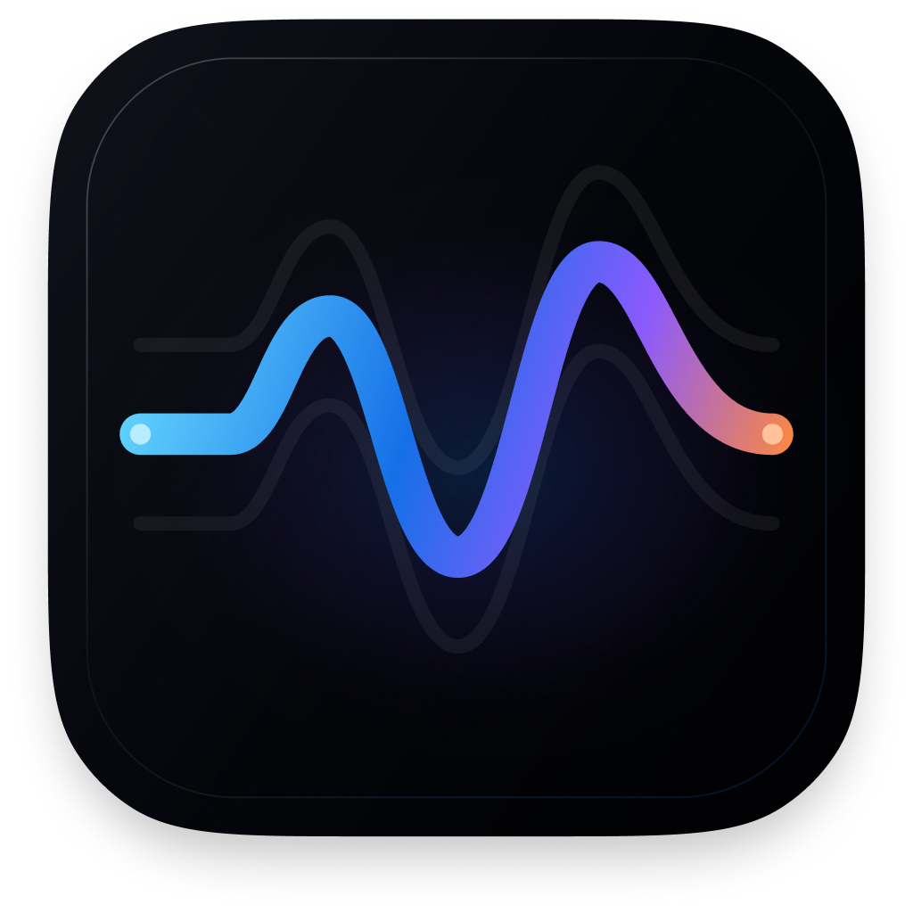

<div align="center">



# Airwave

### A tiny, native internet radio player for macOS.

[](https://www.apple.com/macos/)
[](https://developer.apple.com/xcode/swiftui/)
[](#status)
[](LICENSE)

Turn the dial. Keep the app out of the way.

</div>

Airwave is a free, open-source radio player built specifically for the Mac. It combines a compact SwiftUI window with a tiny menu-bar controller, giving you fast access to radio stations from around the world without accounts, subscriptions, tracking, or a heavyweight media app.

## What Airwave does

- Opens Explore with high-quality stations from your Mac's configured region
- Browses radio by country in a dedicated searchable Countries tab with flags
- Searches stations, languages, and genres globally
- Prefers healthy, high-bitrate streams when multiple sources are available
- Plays and pauses live radio with native `AVPlayer` playback
- Shows live song or program metadata when the station provides it
- Controls app-relative volume from the window or menu bar
- Shows station logos with memory and disk caching
- Remembers favorites, recent stations, the last station, and volume
- Keeps playing when the main window is closed
- Looks and behaves like a macOS 26 app because it is one

## Small by design

Airwave has one job: play internet radio beautifully.

There are no accounts, recommendations, social features, analytics, ads, subscriptions, plug-ins, cross-platform abstractions, or embedded web views. The app uses SwiftUI, AVFoundation, Foundation, and other native Apple frameworks. It has no third-party Swift package dependencies.

## The interface

The main window is a compact station browser with four simple views:

- **Explore** for nearby discovery and global station search
- **Countries** for a locale-first, alphabetical country browser with flags
- **Favorites** for stations you want to keep
- **Recent** for getting back to something quickly

The station list continues behind floating Liquid Glass search and playback controls. The now-playing capsule stays visible at the bottom and shows the station's live song or program metadata when available. A small branded menu-bar controller shows the active station, current metadata, play/pause, volume, and a button to reopen Airwave.

## Radio directory

Station discovery is powered by the free and open-source [Radio Browser](https://www.radio-browser.info/) community directory. Airwave filters broken entries, resolves stream URLs, and fails over between public directory mirrors when one is unavailable.

Radio Browser is a community-maintained catalog, so no directory can guarantee every broadcaster or uninterrupted availability. Airwave handles missing artwork, unavailable stations, and network failures without getting in your way.

## Privacy

Airwave itself has no accounts, analytics, advertising SDKs, or telemetry.

Explore reads the Mac's configured region locally to choose its initial stations. Airwave never requests Location Services and never calls an IP-geolocation provider.

Using the app makes network requests to Radio Browser for station data, to station websites for artwork, and to the selected broadcaster for audio. Those services can receive normal connection information such as your IP address and user agent.

## Requirements

- macOS 26 or later
- An internet connection

## Build and run

Airwave currently builds with Xcode 27 beta while targeting macOS 26 and later.

```bash
git clone https://github.com/JoAz111/airwave.git
cd airwave
./script/build_and_run.sh
```

The script builds the Swift package, compiles the native app-icon catalog, stages `dist/Airwave.app`, applies the sandbox and outgoing-network entitlements, signs it locally, and launches it as a normal foreground Mac app. Run the complete offline test suite with:

```bash
DEVELOPER_DIR=/Applications/Xcode-beta.app/Contents/Developer swift test
```

## Status

Airwave is a working development preview. Locale-led discovery, country browsing, global search, high-quality source selection, playback, live metadata, favorites, recents, cached artwork, native Liquid Glass, the Airwave icon, and menu-bar controls are implemented. Packaged releases are still to come.

If that sounds fun, star the repository and follow along.

## Contributing

Airwave is intentionally narrow in scope. Bug fixes, accessibility improvements, native macOS polish, and focused performance work are welcome. Large new feature areas should start with a discussion so the project stays small.

## License

Airwave is available under the [MIT License](LICENSE).

---

<div align="center">
Built for the Mac, for the fun of it.
</div>
